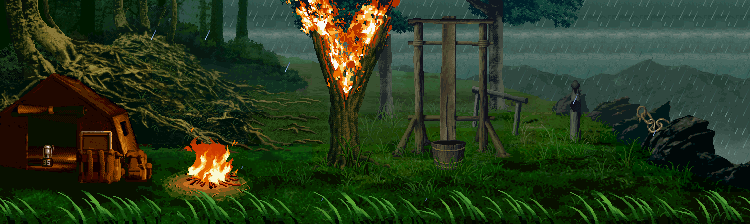

 

&nbsp;&nbsp;&nbsp;&nbsp;

&nbsp;&nbsp;&nbsp;&nbsp;

&nbsp;&nbsp;&nbsp;&nbsp;

 

---

<h2 align="center">◈ WHO I AM</h2>

<table>
<tr>
<td width="65%" valign="top">

I build software for the web, backend systems, and AI-powered applications.

 

My professional work is mainly around:

<b>JavaScript · TypeScript · React · Next.js · Node.js · APIs · Databases · AI</b>

  

Outside of my day-to-day development, I like going deeper into the
technology underneath the software I build.

  

<b>Web → Backend → AI → Linux → Networking → Systems → Security</b>

</td>

<td width="35%" align="center">

  

</td>
</tr>
</table>

---

<h2 align="center">◈ WHAT I DO</h2>

<table>
<tr>

<td width="33%" valign="top">

<h3>⚡ AI & DEVELOPMENT</h3>

Building real software around modern AI systems.

  

• LLM applications 
• AI workflows 
• RAG 
• AI agents 
• Backend systems 
• Web applications

  

<b>JavaScript · TypeScript · React · Next.js · Node.js</b>

</td>

<td width="33%" valign="top">

<h3>◉ SYSTEMS</h3>

A personal rabbit hole I'm actively exploring.

  

• C 
• Linux 
• TCP/IP 
• Socket programming 
• Processes & memory 
• Concurrency 
• Operating systems

  

<b>C · Linux · Networking</b>

</td>

<td width="33%" valign="top">

<h3>⌁ SECURITY</h3>

Still early in the journey — learning the fundamentals.

  

• Network analysis 
• Linux security 
• Reconnaissance 
• Traffic analysis 
• CTFs 
• Vulnerability research

  

<b>Learning · Experimenting · Breaking things</b>

</td>

</tr>
</table>

---

